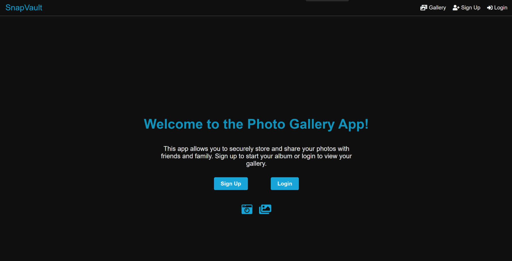
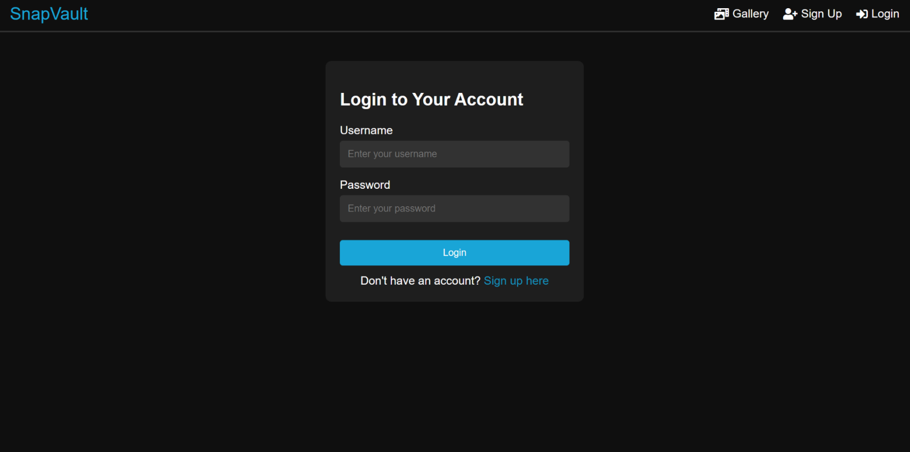
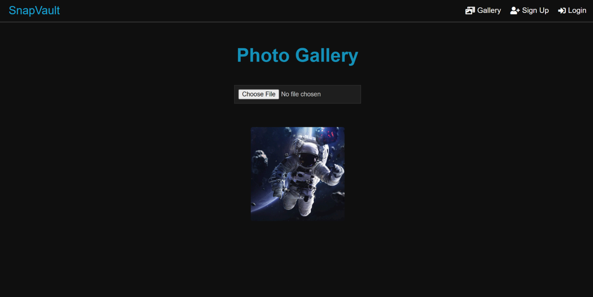

<div align="center">
    
    <h1>Photo Gallery App 📸</h1>
    <a href="https://github.com/your-username/photo-gallery-app">
        
    </a>
    
    
    
    
    
    <a href="https://opensource.org/licenses/MIT">
        
    </a>
</div>

## Table of Contents

1. [Overview](#-overview)
2. [Features and Demo](#features-and-demo)
3. [Setting up the Development Environment](#%EF%B8%8F-setting-up-the-development-environment)
4. [Usage](#-usage)
5. [License](#-license)

## 🌟 Overview

The **Photo Gallery App** is a Flask-based web application that allows users to securely manage and display their photo collections. It integrates functionalities such as user authentication, image uploading, and image retrieval, utilizing React for the frontend and MongoDB for the NoSQL database.

## **Features and Demo**

### Feature 1: Landing Page

- **Description**: Users are greeted with a landing page with a short description of the product and are able to navigate to the login and signup pages, respectively.

  - **Screenshot**:

    

### Feature 2: User Authentication

- **Description**: Secure user authentication using JWT. Users can register, log in, and manage their sessions.

  - **Screenshot**:

    

### Feature 3: Image Upload

- **Description**: Users can upload images, which are stored securely and associated with their account.

  - **Screenshot**:

    

## 🛠️ Setting up the Development Environment

Follow these steps to set up your own instance of the Photo Gallery App:

1. **Clone the Repository**:

   - Use the command `git clone https://github.com/eddayyy/PhotoGalleryApp` to clone the repository.

2. **Set up a Python virtual environment (Optional but recommended)**

   ```bash
   # Install virtualenv if not installed
   pip install virtualenv

   # Create a virtual environment
   virtualenv venv

   # Activate the virtual environment
   # On Windows
   venv\Scripts\activate
   # On MacOS/Linux
   source venv/bin/activate
   ```

3. **Install required packages**

   Install all dependencies listed in the requirements.txt file:

   ```bash
   pip install -r requirements.txt
   ```

4. **Run the application**

   ```bash
   python app.py
   ```

5. **Set up the Front End**

   Install ReactJS and navigate to /photogallery and in your terminal type:

   ```bash
   npm install # to install the dependencies
   ```

   Afterwards, in your terminal type:

   ```bash
   npm start # start the front end server
   ```

   to get the front end running. A browser tab will automatically be opened for you.

## 📄 Usage

After running the backend server, you can access the following endpoints:

- Home: `GET /`
- Register: `POST /register/` - Register a new user.
- Login: `POST /login/` - Authenticate a user and issue a JWT.
- Upload Image: `POST /api/upload` - Upload an image file.
- Get Images: `GET /api/images` - Retrieve images for the authenticated user.

## 📄 License

This project is licensed under the MIT License - see [LICENSE.md](./LICENSE) for details.
